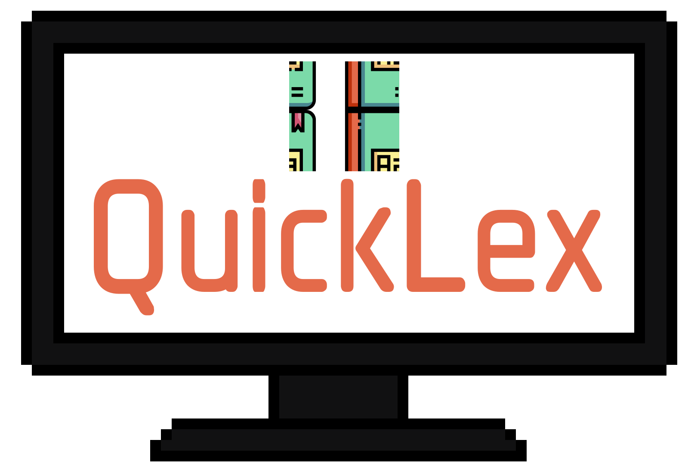

# QuickLex CLI

<p align="center">
  
</p>

The QuickLex CLI project is a command-line application that provides dictionary functionalities, allowing users to search for definitions and usage examples of English words. The application has been developed to provide an easy and fast experience for term lookup without the need to access an online or physical dictionary.

---

## Features

- Using Go-Gin as a router for route management
- Implementing SQLite as the database for the API
- Using GoORM for communication with the database
- Integrating Swagger for API documentation and testing [🚧WIP]
- Creating a modern package structure for organizing the project
- Implementing a complete movie and tv shows rating API with endpoints for searching, creating, editing, and deleting movies and tv shows
- Implementing automated tests to ensure API quality [🚧WIP]

## Installation {#installation}

To use this project, you need to follow these steps:

1. Clone the repository: 
```sh
git clone https://github.com/viniciusdsouza/quicklex.git
```
3. Install the dependencies: 
```sh
go mod download
```
5. Run the Makefile command to build the application:
```sh
make build-cli
```
7. Run the application: 
```sh
echo 'export PATH="/opt/ql:$PATH"' >> ~/.zshrc
```

## Used Tools

This project uses the following tools:

- [Golang](https://golang.org/) for development
- [Cobra](https://github.com/spf13/cobra) for modern Go CLI interactions
- [PTerm](https://github.com/pterm/pterm/tree/master) for prettify texts

## Usage

After installation, QuickLex will be ready to use by calling the command 'ql.' Simply start using the 'get' command followed by the desired word to search for its definitions. Like this:
<p align="center">
  
</p>
